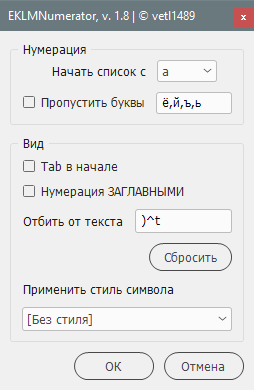

# EKLMNumerator
Скрипт для Adobe InDesign, позволяющий выполнять нумерацию абзацев буквами русского алфавита.

Работа скрипта проверена на InDesign CS5-2023.

## Changelog

### Скрипт обновлен до версии 1.8

Изменения:

- Добавлен чекбокс «Нумерация ЗАГЛАВНЫМИ». Позволяет преобразовать нумерацию в заглавные буквы, без использования специального стиля символов.
- Переписан код формирования интерфейса — убраны фиксированные положения всех элементов.
- Произведен рефакторинг всего кода.
- За дополнения и правки спасибо Михаилу Иванюшину — [https://adobeindesign.ru](https://adobeindesign.ru).
