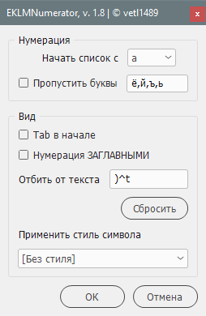

# EKLMNumerator
Скрипт для Adobe InDesign, позволяющий выполнять нумерацию абзацев буквами русского алфавита.

В блоке `Нумерация` выбирается стартовая буква списка `[а-я]` и по надобности включается/выключается исключение некоторых букв из списка. Разделителями между буквами для исключения являются запятые или пробелы. Количество доступных букв для нумерации при этом соответственно сокращается.

В блоке `Вид` есть возможность включить Табуляцию перед нумерацией (добавляется один символ `\t`) для последующей настройки ее в Стиле абзаца или Табуляторами. Чекбоксом `Нумерация ЗАГЛАВНЫМИ` можно изменить все буквы нумерации на ЗАГЛАВНЫЕ, без использования стилей символов. В поле `Отбить от текста` указываются специальные подстановочные символы, (написание которых можно узнать в окне `Найти/Заменить` - вкладка `Текст` - `Заменить на:` - кнопка `@`) и/или любой необходимый текст. По умолчанию `)^t` обозначает скобку и символ табуляции. Кнопка `Сбросить` сбрасывает это поле на значение по умолчанию.

В списке `Применить стиль символа` можно выбрать один из доступных в документе стилей, который применяется ко всей нумерации вида `Tab в начале - буква - отбивка от текста`.

Все внесенные значения сохраняются в конфигурационном файле, который подгружается при каждом запуске.

Работа скрипта проверена на InDesign CS5-2024.

## Changelog

### Версия 1.8.2

- Мелкие правки + косметика.

### Версия 1.8

- Добавлен чекбокс «Нумерация ЗАГЛАВНЫМИ». Позволяет преобразовать нумерацию в заглавные буквы, без использования специального стиля символов.
- Переписан код формирования интерфейса — убраны фиксированные положения всех элементов.
- Произведен рефакторинг всего кода.
- За дополнения и правки спасибо Михаилу Иванюшину — [http://adobeindesign.ru](http://adobeindesign.ru).
